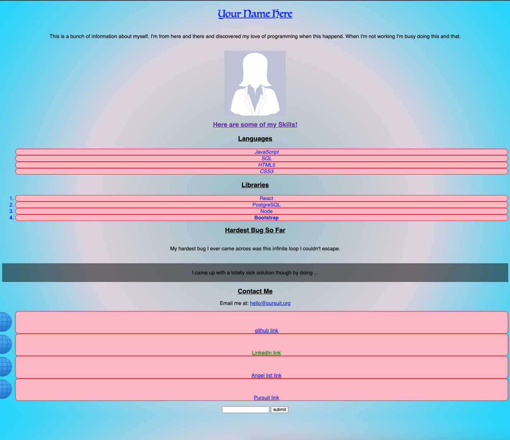

# CSS Selectors Lab

# Introductory CSS Lab

In this lab, you'll have the opportunity to design a personal webpage. The content already exists -- you just need to style it to the best of your ability!

---

## Lab Setup

### Getting started

1. Fork and clone this repository.

1. Navigate to the cloned repository's directory on your command line. Then, run the following command:

   ```
   npm install
   ```

   This will install the libraries needed to run the tests.

1. Open up the repository in VSCode. Follow the instructions below to complete the Lab.

### Tests

To run the tests, you can run the following command from the command line. You will need to be in the root directory of your local directory.

```
npm test
```

This will open the Cypress testing window, where you can click to run an individual suite of tests or all of the tests at once.

## Instructions

To complete the tests in this lab, you will need to add the following styles. If you're unclear about any of the instructions below, remember that you can check the test file to see what exactly is being tested.

- [ ] Set all paragraph text to have a font of `Helvetica, sans-serif`.
- [ ] Set all headings to have a font of `George, serif`.
- [ ] The profile photo should have a class of `profile-photo`. Then, update your CSS so that any element with the `profile-photo` class has a `blue` border that has a `1px` width.
- [ ] Align all text within the `body` element to be in the center of the page.
- [ ] Update the style of all headings so that they are bold and have an blue underline. Note that an underline _is not_ the same as a border.
- [ ] Add a class of `skills-header` to the relevant `h2` element. Then, update your CSS so that any element with a `skills-header` class has the color `rebeccapurple`.
- [ ] Change all links on the page so that they show up `red`.
- [ ] The unordered list underneath the "Languages" heading should include a class of `languages-list`. Then, style all lists that have that class to have a `list-style-image` property with the value being the [globe](./assets/globe.png) image stored in the `assets/` folder.

Once you've completed these tasks, continue to style your page. Consider adding specific styles to all list items, only list items under the "Libraries" heading, the introductory paragraph, and the "Hardest Bug So Far" section.


